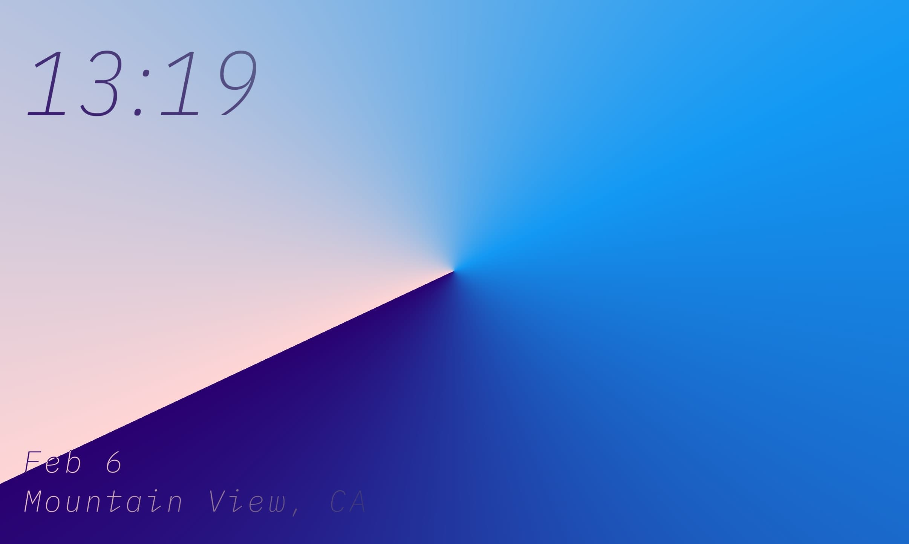
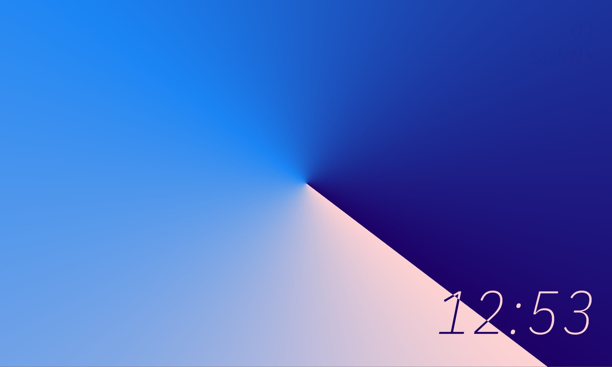
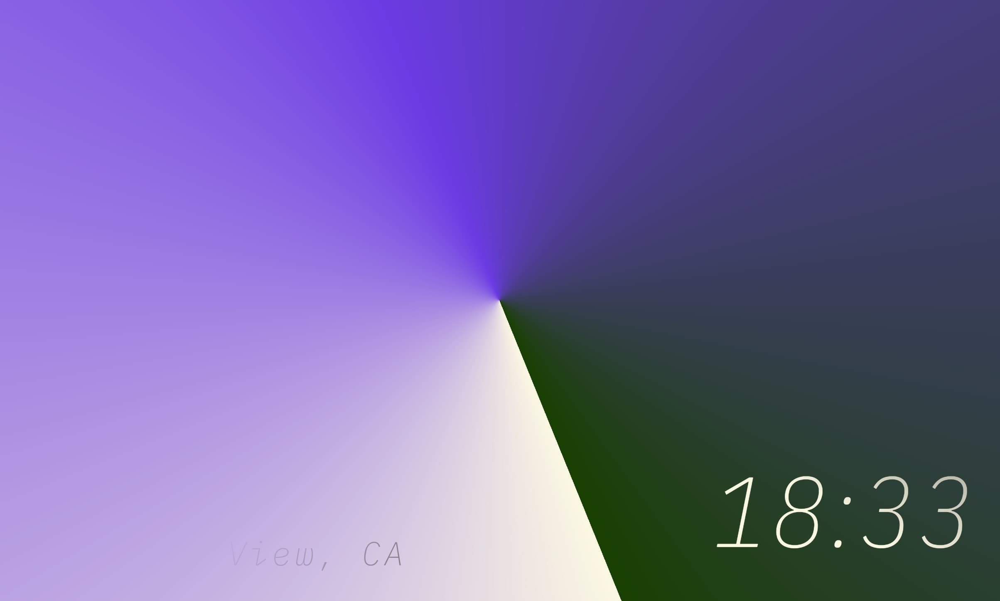
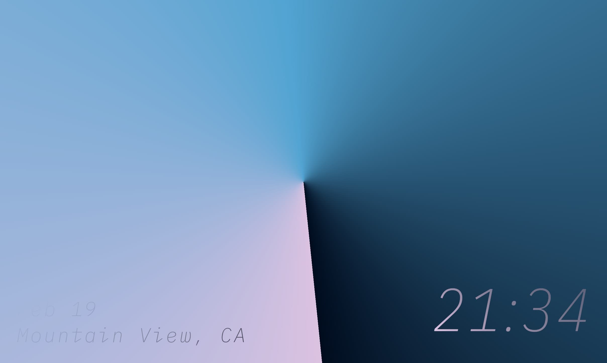
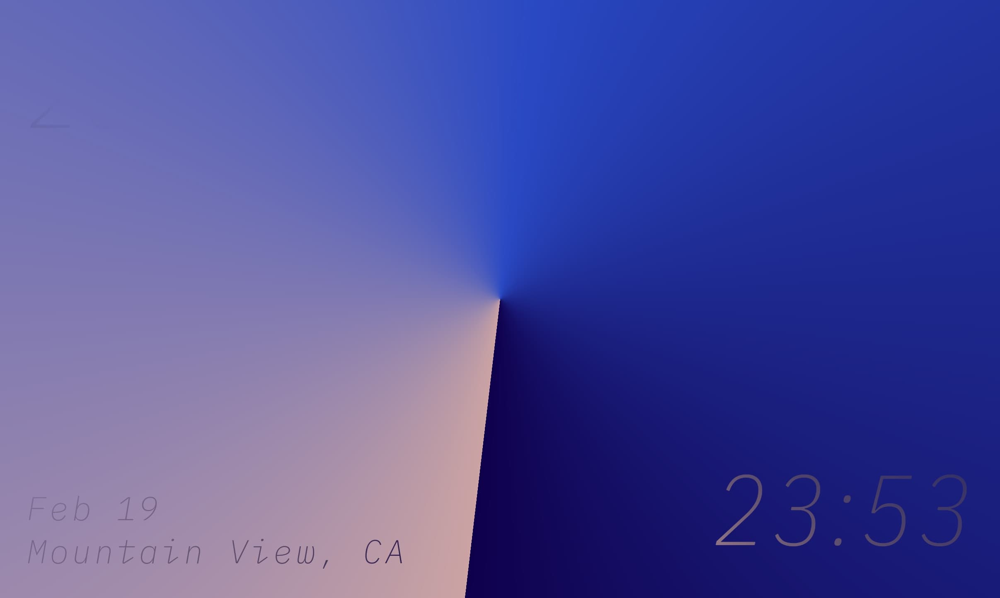
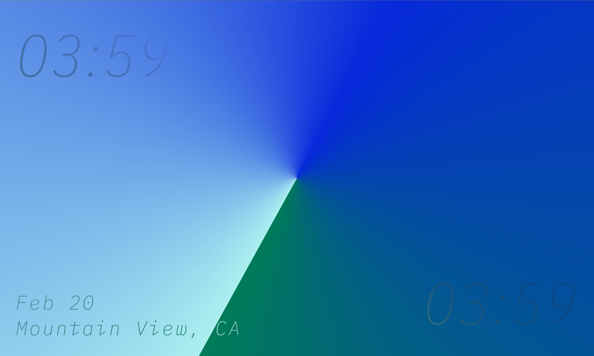
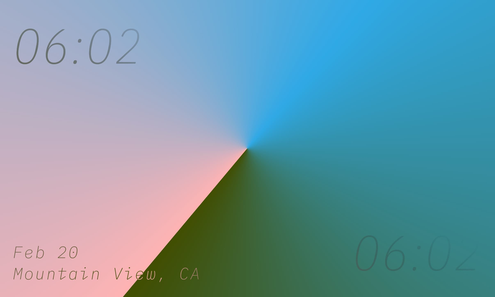
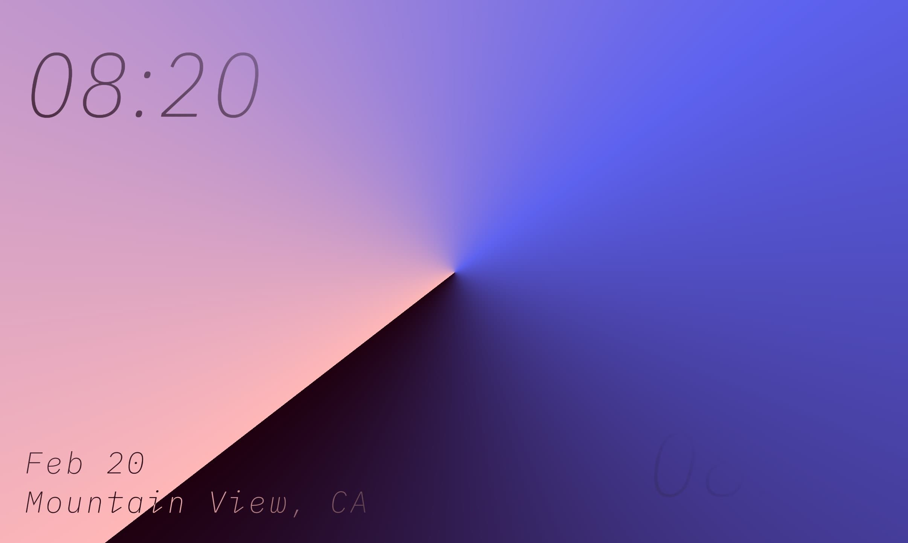
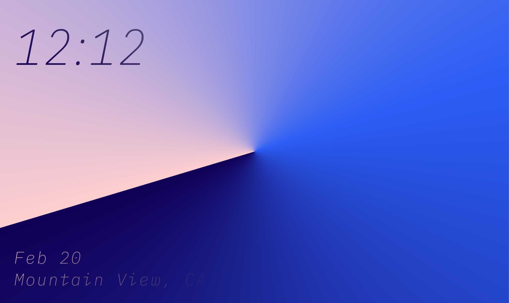
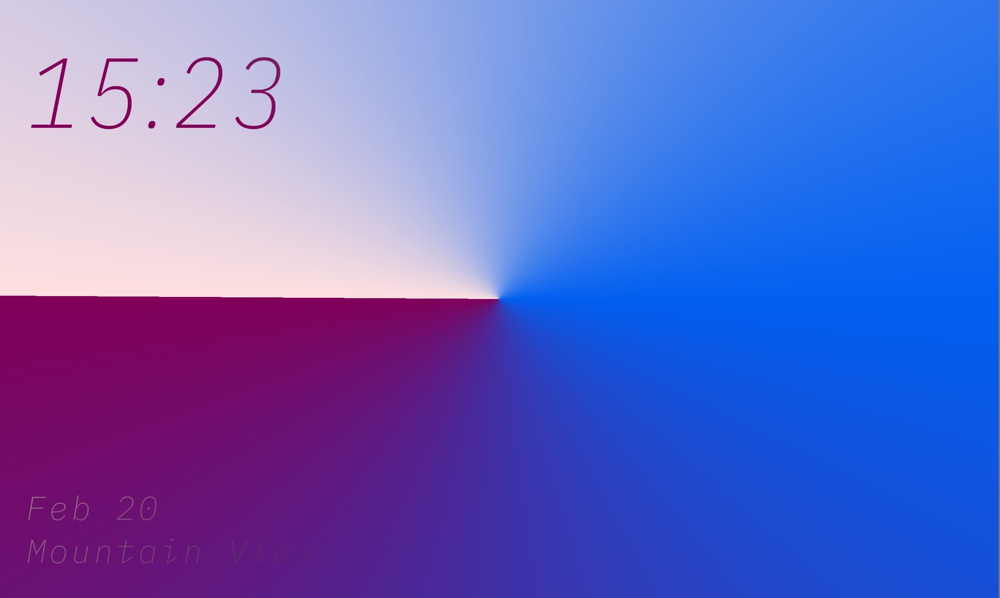

# Conic Clock

> Conic Clock is a dynamic clock written in Flutter. It is a project by me (ZHENG HAOTIAN / Justin Fincher) for the [Flutter Clock challenge](https://flutter.dev/clock). 

The conic shadow angle represents seconds. On top left and bottom right there are hours and minutes, while on top right there is the weather and bottom left be the location.  
The color scheme would adapt depending on the time, weather, and temperature. For example, at 6:00 it would be sunrise (pink + pale blue), in rainstorm weather it would be darker, at a high temperature color would be more vibrant, etc.  
Please see the Youtube video below for more info.

# Youtube

[See a demo video](https://www.youtube.com/watch?v=PzMQfQRS5k8)

# Screenshots

| Time | Weather | Screenshot |
|------|---------|------------|
|12:53|Clear||
|18:33|Clear||
|21:34|Clear||
|23:53|Clear||
|03:59|Clear||
|06:02|Clear||
|08:20|Clear||
|12:12|Clear||
|15:23|Clear||

# Tips

For debugging, [conic_clock.dart](conic_clock/lib/conic_clock.dart) has a property called `_lightYearMode`. Use it as a time lapse toggle, time would be 3000x faster than normally it would be.